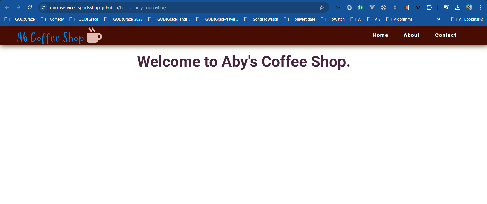

# Top Bavbar in HTML, CSS, and JavaScript

I am learning to design Top Navbar from different Video Courses, Books, and Websites

## Hosted URL

> 1. <https://microservices-sportsshop.github.io/hcjjs-2-only-topnavbar/>

